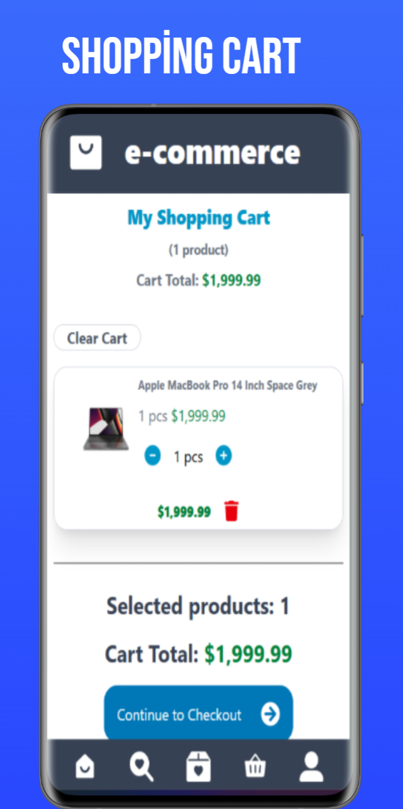
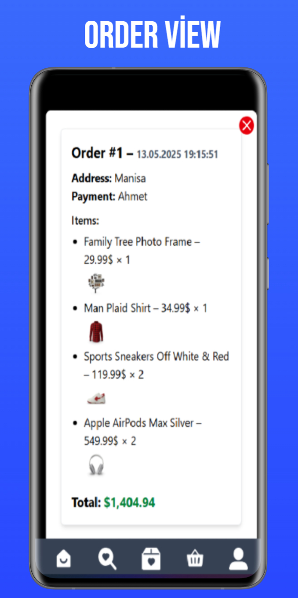
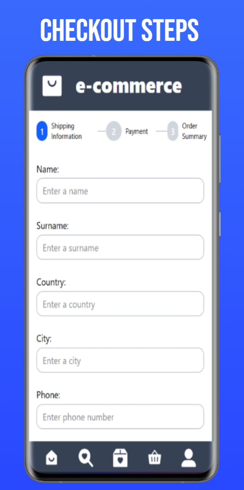

# 🛍️ E-Commerce Web App

This project is a modern e-commerce web app built using React and Vite. It fetches product data from the mock API [dummyjson.com](https://dummyjson.com/).

## 🚀 Features

- 🔄 React + Vite architecture
- 📦 State management with Redux Toolkit
- 🔔 User notifications with React Toastify
- 🛒 Product listing, detail pages, and category filtering
- 💥 Special discount sections (Huge Sale, Products on Sale, etc.)
- 🎨 Responsive design using Tailwind CSS
- 📡 Axios for API requests (with interceptors for error handling)

## 📁 Project Structure

src/
├── api/ # Axios configuration and endpoints
├── components/ # Reusable components
├── features/ # Redux slices
├── pages/ # Pages (home, detail, category etc.)
├── routes/ # Routing configuration
├── App.jsx # Main app component
└── main.jsx # Entry point






## ⚙️ Getting Started

```bash
git clone https://github.com/username/e-commerce-app.git
cd e-commerce-app
npm install
npm run dev
```
